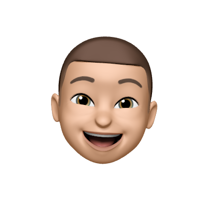

 
  <h1>Ewan</h1>
 
  
Hello

  
 

   
   
  

 
 
 
 

    
I'm currently a first-year Computer Science student at IUT de Vannes.

      <li align="left">Contact: <a href="mailto:contact@ewanquelo.com" style="color: #58A6FF; text-decoration: none;">contact@ewanquelo.com</a> or via <a href="https://github.com/EwanQuelo/EwanQuelo/issues" style="color: #58A6FF; text-decoration: none;">GitHub Issues</a>.</li>
  

---

  <h2 align="center" style="color: #C9D1D9; margin-bottom: 10px;">My Tech Stack & Tools</h2>

  <h3 align="center" style="color: #8B949E; font-weight: 500; margin-top: 20px; margin-bottom: 15px;">Languages & Frameworks</h3>
  

    
    
    
    
    
    
    
    
    
    
  

  <h3 align="center" style="color: #8B949E; font-weight: 500; margin-top: 25px; margin-bottom: 15px;">Development Tools</h3>
  

    
    
    
    
    
  

---

  <h2 align="center" style="color: #C9D1D9; margin-bottom: 25px;">GitHub Stats</h2>
  

    
      
   
   
  

  

  <!--  -->
  

---

  <h2 align="center" style="color: #C9D1D9; margin-bottom: 25px;">Projects</h2>
  

    
    
  

  

    
  

---
